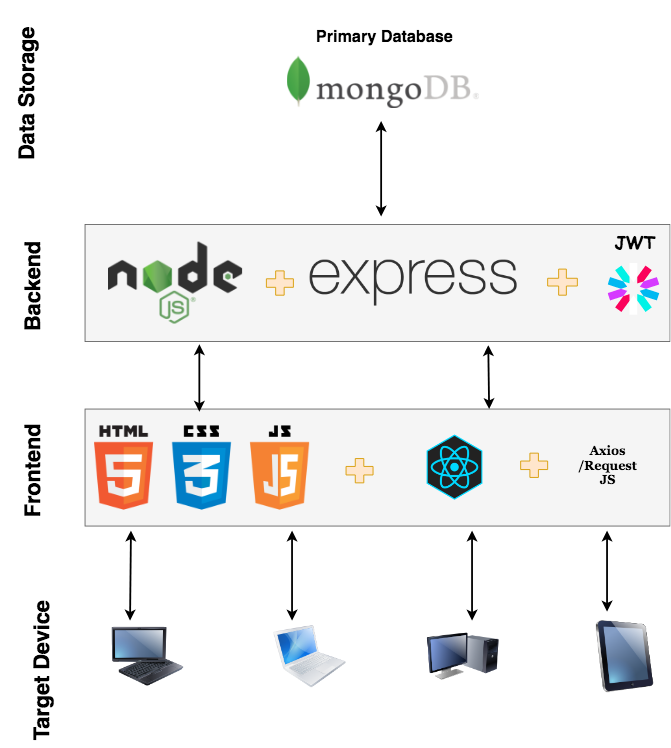

# Foody Buddy


## Tech stack



> My Option use *Go* better

    1. Go's native concurrency
    2. Very good for network application. http native package enabled with go concurrency with channels with give performance 33% compared to the other language.
    3. Faster build

> Why I have not choose it

    1. Need to follow domain driven design (DDD), else maintaining becomes difficulty
    2. Lot of ground work need

## Why NodeJS

> Node.js is an platform built on a fast, JavaScript-based runtime: V8.

    1. Concurrency support using the event-callback mechanism
    2. Single tech stack for both front-end and back-end
    3. Lots of great frameworks

* ### Express

> [Express] provides a thin layer of fundamental web application features, without obscuring Node.js

    1. Composable middleware
    2. Robust set of features (Body parser, CROS, Security)

* ### JWT

> [Jwt] (Json Web Token)

    1. Stateless authentication
    2. Better algorithm, client library support.

## Why MongoDB (No SQL)

> [MongoDB] offers a rich set of features and functionality far beyond those offered by simple NoSQL data stores.

    1. MongoDB has a rich query language, highly-functional secondary indexes
    2. ACID Transactions
    3. Flexible, rich data model
    4. Horizontal scale-out with data locality controls
    5. Single document better performance, indexing for faster retrieval of data.

## Pre request

1. [Docker](https://runnable.com/docker/install-docker-on-linux)
2. [Docker composer](https://docs.docker.com/compose/install)

## Problem encountered

```bash
# Unable to run build command
$ ./build.sh
bash: ./build.sh: Permission denied
$ sudo chmod +x build.sh
Password:

```

## Directory structure

```bash
- scripts /
    |__ postman /
            |__ Amazon-SES.postman_collection
- src/
  |__ app.js
  |__ public /
  |__ config /
  |__ controllers /
  |__ handlers
          |__ mongo /
                |__ mongoClient.js
          |__ logs.js
  |__ router.js
  |__ tests /
  |__ DockerFile
  |__ package.json
```

## TODO

* [x] Module design
* [ ] Database integration
* [ ] User Sign-up and Sign-in with MongoDB
* [x] JWT Authorization token handle user claims
* [ ] Front-end React app creation
* [ ] Unit testing (*JEST*)
* [ ] Node cluster

[Express]: <http://expressjs.com>
[MongoDB]: <https://docs.mongodb.com/>
[eslint]: <http://eslint.org/>
[Jwt]: <http://jwt.io/>
